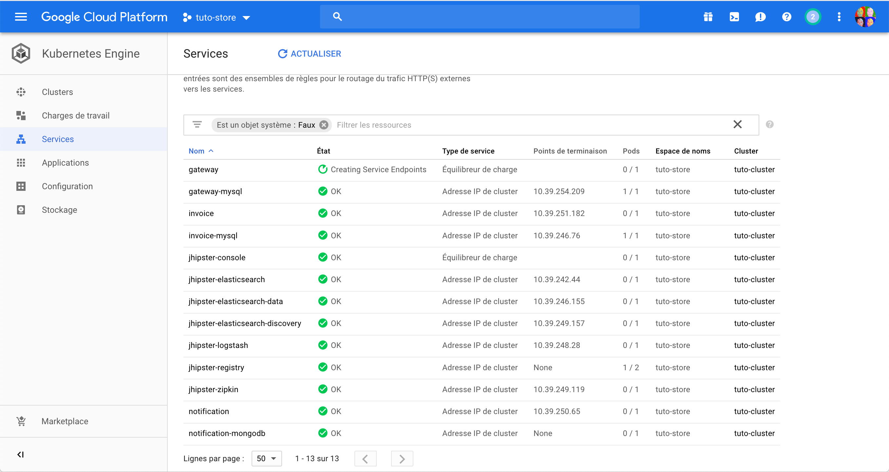
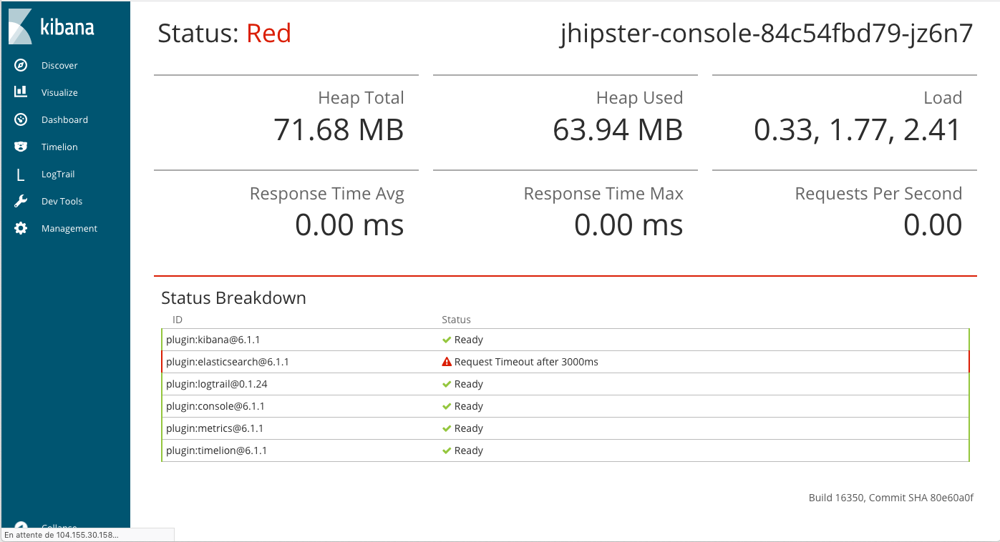
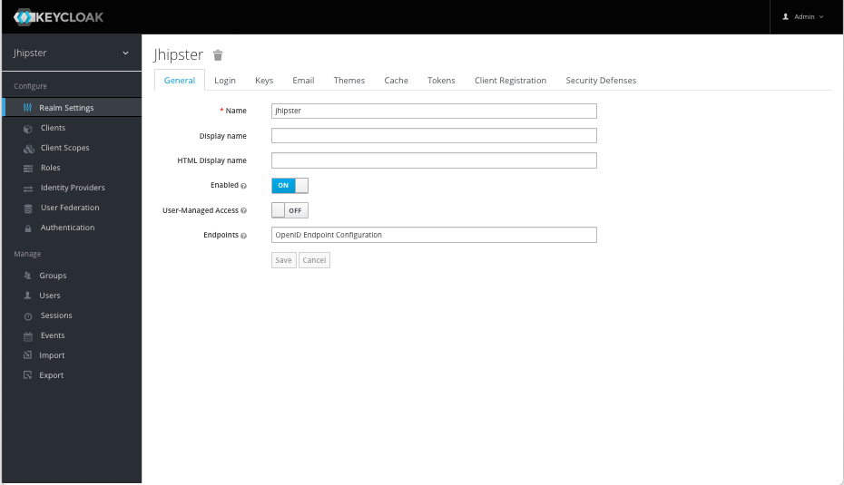

# Tutoriel sur les microservices avec JHipster :: Microservices

L'objectif de cette partie est la mise en place de microservices avec l'infrastructure microservices de JHipster.

## Création de la gateway et des microservices
L'infrastructure de base est constitué de :
* du registre de services de JHipster
* de l'API Gateway de JHipster
* d'un microservice productorder (utilisant une base de données mysql)
* d'un microservice invoice (utilisant une base de données postgres)
* d'un microservice notification (utilisant une base de données mongodb)

Le frontend permet d'accéder à l'ensemble des entités est servi par l'API Gateway.

### Création de la gateway (vierge)
```bash
mkdir -p ~/github/mastering-microservices/gateway
cd  ~/github/mastering-microservices/gateway
jhipster
```
Répondez aux questions suivantes:
```
? Which *type* of application would you like to create? Microservice gateway
? What is the base name of your application? gateway
? As you are running in a microservice architecture, on which port would like your server to run? It should be uniq
ue to avoid port conflicts. 8080
? What is your default Java package name? com.mycompany.store
? Which service discovery server do you want to use? JHipster Registry (uses Eureka, provides Spring Cloud Config s
upport and monitoring dashboards)
? Which *type* of authentication would you like to use? JWT authentication (stateless, with a token)
? Which *type* of database would you like to use? SQL (H2, MySQL, MariaDB, PostgreSQL, Oracle, MSSQL)
? Which *production* database would you like to use? MySQL
? Which *development* database would you like to use? H2 with disk-based persistence
? Do you want to use Hibernate 2nd level cache? Yes
? Would you like to use Maven or Gradle for building the backend? Gradle
? Which other technologies would you like to use?
? Which *Framework* would you like to use for the client? Angular
? Would you like to enable *SASS* stylesheet preprocessor? Yes
? Would you like to enable internationalization support? Yes
? Please choose the native language of the application English
? Please choose additional languages to install French
? Besides JUnit and Jest, which testing frameworks would you like to use? Gatling, Cucumber, Protractor
? Would you like to install other generators from the JHipster Marketplace? No
```

### Création d'un microservice (vierge) productorder
```bash
mkdir -p ~/github/mastering-microservices/productorder
cd  ~/github/mastering-microservices/productorder
jhipster
```
Répondez aux questions suivantes:
```
? Which *type* of application would you like to create? Microservice application
? What is the base name of your application? productorder
? As you are running in a microservice architecture, on which port would like your server to run? It should be uniq
ue to avoid port conflicts. 8081
? What is your default Java package name? com.mycompany.store
? Which service discovery server do you want to use? JHipster Registry (uses Eureka, provides Spring Cloud Config s
upport and monitoring dashboards)
? Which *type* of authentication would you like to use? JWT authentication (stateless, with a token)
? Which *type* of database would you like to use? SQL (H2, MySQL, MariaDB, PostgreSQL, Oracle, MSSQL)
? Which *production* database would you like to use? MySQL
? Which *development* database would you like to use? H2 with disk-based persistence
? Do you want to use the Spring cache abstraction? Yes, with the Hazelcast implementation (distributed cache, for m
ultiple nodes)
? Do you want to use Hibernate 2nd level cache? Yes
? Would you like to use Maven or Gradle for building the backend? Gradle
? Which other technologies would you like to use?
? Would you like to enable internationalization support? Yes
? Please choose the native language of the application English
? Please choose additional languages to install French
? Besides JUnit and Jest, which testing frameworks would you like to use? Gatling, Cucumber
? Would you like to install other generators from the JHipster Marketplace? No
```

### Création d'un microservice (vierge) invoice
```bash
mkdir -p ~/github/mastering-microservices/invoice
cd  ~/github/mastering-microservices/invoice
jhipster
```
Répondez aux questions suivantes:
```
? Which *type* of application would you like to create? Microservice application
? What is the base name of your application? invoice
? As you are running in a microservice architecture, on which port would like your server to run? It should be uniq
ue to avoid port conflicts. 8082
? What is your default Java package name? com.mycompany.store
? Which service discovery server do you want to use? JHipster Registry (uses Eureka, provides Spring Cloud Config s
upport and monitoring dashboards)
? Which *type* of authentication would you like to use? JWT authentication (stateless, with a token)
? Which *type* of database would you like to use? SQL (H2, MySQL, MariaDB, PostgreSQL, Oracle, MSSQL)
? Which *production* database would you like to use? PostgreSQL
? Which *development* database would you like to use? H2 with disk-based persistence
? Do you want to use the Spring cache abstraction? Yes, with the Hazelcast implementation (distributed cache, for m
ultiple nodes)
? Do you want to use Hibernate 2nd level cache? Yes
? Would you like to use Maven or Gradle for building the backend? Gradle
? Which other technologies would you like to use?
? Would you like to enable internationalization support? Yes
? Please choose the native language of the application English
? Please choose additional languages to install French
? Besides JUnit and Jest, which testing frameworks would you like to use? Gatling, Cucumber
? Would you like to install other generators from the JHipster Marketplace? No
```

### Création d'un microservice (vierge) notification
```bash
mkdir -p ~/github/mastering-microservices/notification
cd  ~/github/mastering-microservices/notification
jhipster
```

```
? Which *type* of application would you like to create? Microservice application
? What is the base name of your application? notification
? As you are running in a microservice architecture, on which port would like your server to run? It should be unique to avoid port confl
icts. 8082
? What is your default Java package name? com.mycompany.store
? Which service discovery server do you want to use? JHipster Registry (uses Eureka, provides Spring Cloud Config support and monitoring
dashboards)
? Which *type* of authentication would you like to use? JWT authentication (stateless, with a token)
? Which *type* of database would you like to use? MongoDB
? Do you want to use the Spring cache abstraction? Yes, with the Hazelcast implementation (distributed cache, for multiple nodes)
? Would you like to use Maven or Gradle for building the backend? Gradle
? Which other technologies would you like to use?
? Would you like to enable internationalization support? Yes
? Please choose the native language of the application English
? Please choose additional languages to install French
? Besides JUnit and Jest, which testing frameworks would you like to use? Gatling, Cucumber
? Would you like to install other generators from the JHipster Marketplace? No
```

### Lancement du registre
```bash
cd ~/github/mastering-microservices/gateway
docker-compose -f src/main/docker/jhipster-registry.yml up
```

### Lancement de la gateway
Lancez l'application en profil `dev`.
```bash
cd ~/github/mastering-microservices/gateway
./gradlew
```

### Visite guidée de l'application gateway
```bash
open http://localhost:8080
```
[Plus d'information ...](https://www.jhipster.tech/api-gateway/)

### Visite guidée du registre
```bash
open http://localhost:8761
```
[Plus d'information ...](https://www.jhipster.tech/jhipster-registry/)

### Lancement du microservice productorder
Lancez l'application en profil `dev`.
```bash
cd  ~/github/mastering-microservices/productorder
./gradlew
```
> Remarque : La base de données utilisée est H2 pour le profil `dev`. En profil `prod`, il y aura un conflit de prot (`3306`) entre le container mysql utilisé par la gateway et celui utilisé par le microservice.

Consultez le descripteur Swagger
```bash
wget http://localhost:8081/v2/api-docs -O swagger.json
jq "." swagger.json
```

### Lancement du microservice invoice
Lancez l'application en profil `dev`.
```bash
cd  ~/github/mastering-microservices/invoice
./gradlew
```

Consultez le descripteur Swagger
```bash
wget http://localhost:8082/v2/api-docs -O swagger.json
jq "." swagger.json
```

### Lancement d'un microservice (vierge) notification
Lancez le container mongodb.
```bash
cd  ~/github/mastering-microservices/notification
docker-compose -f src/main/docker/mongodb.yml up -d
docker-compose -f src/main/docker/mongodb.yml logs -f
```

Lancez l'application en profil `dev` (attendre que mongodb soit prêt au service).
```bash
cd  ~/github/mastering-microservices/notification
./gradlew
```

Consultez le descripteur Swagger
```bash
wget http://localhost:8083/v2/api-docs -O swagger.json
jq "." swagger.json
```

### Visite guidée de l'application gateway
```bash
open http://localhost:8080
```
> Que voyez vous ?
> Que se passe t'il si un des microservices est arrêté (simulation d'une panne, ...)?

### Visite guidée du registre
```bash
open http://localhost:8761
```
> Que voyez vous ?
> Que se passe t'il si un des microservices est arrêté (simulation d'une panne, ...)?

## Refactoring de l'application
Il convient maintenant de réurbaniser le schéma de l'application online-store en microservices puis de générer le code de ces derniers.

Les entités du schéma initial sont répartis entre
* et le microservice productorder [productorder-jdl.jh](./productorder-jdl.jh)
* et le microservice invoice [invoice-jdl.jh](./invoice-jdl.jh)

De nouvelles entités sont ajoutées dans le microservice notification [notification-jdl.jh](./notification-jdl.jh)

L'ensemble des entités décrites dans la définition [gateway-jdl-all.jh](./gateway-jdl-all.jh) servira à la génération du frontend qui sera servi par l'API gateway.

La relation OneToMany `ProductOrder{invoice} to Invoice{order}` est remplacé par une propriété `invoiceId` dans l'entité `ProductOrder`.

## Génération du code de la gateway
```bash
cd  ~/github/mastering-microservices/gateway
jhipster import-jdl ../tutorial/gateway-jdl-all.jh
```

## Génération du code du microservice productorder

```bash
cd  ~/github/mastering-microservices/productorder
jhipster import-jdl ../tutorial/productorder-jdl.jh
```

## Génération du code du microservice invoice

```bash
cd  ~/github/mastering-microservices/invoice
jhipster import-jdl ../tutorial/invoice-jdl.jh
```

## Génération du code du microservice notification

```bash
cd  ~/github/mastering-microservices/notification
jhipster import-jdl ../tutorial/notification-jdl.jh
```

### Lancement du registre
Si ce n'est pas déjà le cas, lancez le registre.
```bash
cd ~/github/mastering-microservices/gateway
docker-compose -f src/main/docker/jhipster-registry.yml up -d
docker-compose -f src/main/docker/jhipster-registry.yml logs -f
```

### Lancement de la gateway
Lancez l'application en profil `dev`.
```bash
cd ~/github/mastering-microservices/gateway
./gradlew
```

### Lancement du microservice productorder
Lancez l'application en profil `dev`.
```bash
cd  ~/github/mastering-microservices/productorder
./gradlew
```

### Lancement du microservice invoice
Lancez l'application en profil `dev`.
```bash
cd  ~/github/mastering-microservices/invoice
./gradlew
```

### Lancement d'un microservice notification
(Re)lancez le container mongodb.
```bash
cd  ~/github/mastering-microservices/notification
docker-compose -f src/main/docker/mongodb.yml up -d
docker-compose -f src/main/docker/mongodb.yml logs -f
```

Lancez l'application en profil `dev` (attendre que mongodb soit prêt au service).
```bash
cd  ~/github/mastering-microservices/invoice
./gradlew
```

## Construction des images des containers de production

```bash
cd  ~/github/mastering-microservices/gateway
./gradlew -Pprod bootWar buildDocker -x test
docker images | grep gateway

cd  ~/github/mastering-microservices/productorder
./gradlew -Pprod bootWar buildDocker -x test
docker images | grep productorder

cd  ~/github/mastering-microservices/invoice
./gradlew -Pprod bootWar buildDocker -x test
docker images | grep invoice

cd  ~/github/mastering-microservices/notification
./gradlew -Pprod bootWar buildDocker -x test
docker images | grep notification
```

## Génération des docker-compose files
```bash
mkdir -p  ~/github/mastering-microservices/docker-compose
cd  ~/github/mastering-microservices/docker-compose
jhipster docker-compose
```
Répondez aux questions suivantes:
```
? Which *type* of application would you like to deploy? Microservice application
? Which *type* of gateway would you like to use? JHipster gateway based on Netflix Zuul
? Enter the root directory where your gateway(s) and microservices are located ../
3 applications found at ~/github/mastering-microservices/
? Which applications do you want to include in your configuration? gateway, invoice, notification
? Which applications do you want to use with clustered databases (only available with MongoDB and Couchbase)? notification
? Do you want to setup monitoring for your applications ? Yes, for logs and metrics with the JHipster Console (based on ELK and Zipkin)
? You have selected the JHipster Console which is based on the ELK stack and additional technologies, which one do you want to use ? Curator, to help you curate and manage your Elasticsearch indices, Zipkin, for distributed tracing (only compatible with JHipster >= v4.2.0) JHipster registry detected as the service discovery and configuration provider used by your apps
? Enter the admin password used to secure the JHipster Registry admin
```

Lancez les containers via la composition
```bash
docker-compose up -d
docker-compose ps
docker-compose logs -f
```

Créez une instance supplémentaire de `invoice-app`
```bash
docker-compose scale invoice-app=2
```


## Supervision des Microservices
La console de supervision de JHipster s'appuie sur ELK et Zipkin.

[Plus de détail](https://www.jhipster.tech/monitoring/).

```bash
cd ~/github/mastering-microservices
git clone https://github.com/jhipster/jhipster-console.git
cd jhipster-console
docker-compose up -d
docker-compose ps
docker-compose logs -f
```
Ouvrez la Console
```bash
open http://localhost:5601
```
Il faut préalablement modifier à la propriété `logging.logstash.enabled=true` dans le fichier `application-prod.yml` de la gateway et des microservices puis regénérer et redémarrer leurs containers.

```bash
open http://localhost:5601
```

## Deploiement avec Kubernetes

```bash
docker --version
kubectl version
```

Générez les descripteurs de déploiement Kubernetes
```bash
cd ~/github/mastering-microservices/
mkdir kubernetes && cd kubernetes
jhipster kubernetes
```
Répondez aux questions suivantes:
```
? Which *type* of application would you like to deploy? Microservice application
? Enter the root directory where your gateway(s) and microservices are located ../
3 applications found at ~/github/mastering-microservices/
? Which applications do you want to include in your configuration? gateway, invo
ice, notification
? Do you want to setup monitoring for your applications ? Yes, for logs and metr
ics with the JHipster Console (based on ELK and Zipkin)
? Which applications do you want to use with clustered databases (only available with MongoDB and Couchbase)? notification
JHipster registry detected as the service discovery and configuration provider used by your apps
? Enter the admin password used to secure the JHipster Registry admin
? What should we use for the Kubernetes namespace? store
? What should we use for the base Docker repository name? masteringmicroservice
? What command should we use for push Docker image to repository? docker push
? Do you want to configure Istio? Not required
? Choose the kubernetes service type for your edge services LoadBalancer - Let a kubernetes cloud provider automatically assign an IP
```

> Remarque: Si vous souhaitez utiliser Google Container Registry pour héberger des images de conteneur dans un registre privé, vous devrez utiliser pour le nom de base du référentiel Docker défini sur gcr.io/YOUR_PROJECT_ID (gcr.io/tuto-store dans cet exercice).

Jetez un coup d'oeil aux fichier générés
```bash
tree .
cat ./kubectl-apply.sh
```

Loggez vous sur votre dépôt public (hub.docker.com) or privé (gcr.io).
```bash
docker login
> Login with your Docker ID to push and pull images from Docker Hub. If you don't have a Docker ID, head over to https://hub.docker.com to create one.
> Username: masteringmicroservice
> Password:
```

Poussez les images vers votre dépôt public (hub.docker.com) or privé (Container Registry de GCP https://console.cloud.google.com/gcr/images/tuto-store?project=tuto-store).

```
REPO=masteringmicroservice

push_image(){
  CONTAINER=$1
  docker image tag $CONTAINER $REPO/$CONTAINER
  docker images | grep $CONTAINER
  docker push $REPO/$CONTAINER
}

push_image gateway
push_image invoice
push_image productorder
push_image notification

open https://hub.docker.com/r/$REPO/
```

Créez un cluster dans la zone europe-west1-b de GCE depuis https://console.cloud.google.com/kubernetes/list




Lancez les containers sur le cluster
```
gcloud container clusters get-credentials tuto-cluster --zone  europe-west1-b
```

```
./kubectl-apply.sh
```

Repérez les adresses IP des composants avec
```
kubectl get svc -n tuto-store
```


Repérez l'adresse IP externe de la gateway avec
```
kubectl get svc gateway -n tuto-store
```
```
NAME      TYPE           CLUSTER-IP      EXTERNAL-IP    PORT(S)          AGE
gateway   LoadBalancer   10.123.456.789   35.123.456.789   8080:32082/TCP   8h
```

Ouvrez la page du service store (le frontend Angular est livré sur la gateway):
```
open http://35.123.456.789:8080
```

Repérez l'adresse IP externe de la console avec
```
kubectl get svc jhipster-console -n tuto-store
```




Plus de commandes kubectl https://kubernetes.io/docs/reference/kubectl/overview/

Exposez le registre et repérez l'adresse IP externe de le registre avec les instructions suivantes
```
kubectl expose service jhipster-registry --type=NodePort --name=exposed-registry -n tuto-store
kubectl get svc exposed-registry -n tuto-store
kubectl scale statefulset jhipster-registry --replicas 2 -n tuto-store
```

Répliquez le registre exposé
```
kubectl get svc exposed-registry -n tuto-store
kubectl scale statefulset jhipster-registry --replicas 2 -n tuto-store
kubectl get svc exposed-registry -n tuto-store
```

## Communication entre microservices par envoi asynchrone de messages

L'objectif de cet exercice est d'implémenter le patron "[Message Passing](https://microservices.io/patterns/communication-style/messaging.html)" entre le microservice `productorder` et le microservice `notification`.

JHipster permet une communication entre microservices par l'envoi asynchrone de messages via des brokers de messages tels que RabbitMQ ou Apache Kafka. Cette fonction fait partie de [Spring Cloud Stream](https://cloud.spring.io/spring-cloud-static/Dalston.SR5/multi/multi__introducing_spring_cloud_stream.html).

En première partie, vous mettrez en place un canal de communication asynchrone avec le broker RabbitMQ entre ces 2 microservices.

En seconde partie, vous mettrez un canal de communication asynchrone avec le broker Kafka entre ces 2 microservices.

### Communication entre microservices par envoi asynchrone de messages avec RabbitMQ

Installez le [générateur generator-jhipster-spring-cloud-stream](https://github.com/hipster-labs/generator-jhipster-spring-cloud-stream)
```bash
yarn global add generator-jhipster-spring-cloud-stream
```

Lancez le générateur `generator-jhipster-spring-cloud-stream` avec le microservice `notification`
```bash
cd ~/github/mastering-microservices/notification
yo jhipster-spring-cloud-stream
git status
```

Lancez le générateur `generator-jhipster-spring-cloud-stream` avec le microservice `productorder`
```bash
cd ~/github/mastering-microservices/productorder
yo jhipster-spring-cloud-stream
git status
```
Répondez aux questions avec les mêmes réponses.

Plusieurs classes intéressantes sont générées dans les 2 projets:

La classe `com.mycompany.store.config.CloudMessagingConfiguration` implémente la connection au broker RabbitMQ.

Les propriétés suivantes sont ajoutées dans les fichiers de configuration `src/main/resources/config/application-*.yml` :
* `spring.cloud.stream.default.contentType`
* `spring.cloud.stream.bindings.input.destination`
* `spring.cloud.stream.bindings.output.destination`
* `spring.cloud.stream.bindings.rabbit.bindings.output.producer`

La classe `com.mycompany.store.domain.JhiNotificationEvent` est un exemple de message échangeable via RabbitMQ. Vous pourrez modifier et ajouter des propriétés ultérieurement.

La classe `com.mycompany.store.service.stream.NotificationEventSink` est un exemple de souscripteur de messages. Les messages recus sont stockés dans une liste (non persistante). Le topic de souscription est (par défaut) défini dans la propriété `spring.cloud.stream.bindings.input.destination` (`application-*.yml`)

La classe `com.mycompany.store.web.rest.NotificationEventResource` est un exemple de ressource
* avec une opération POST pour publier un message sur le topic (par défaut) défini dans la propriété `spring.cloud.stream.bindings.output.destination` (`application-*.yml`)
* avec une opération GET pour récupérer la liste non persistance des messages recus du topic

Lancez de RabbitMQ depuis un des 2 projets (`notification` par exemple) sur Term 1:
```bash
cd ~/github/mastering-microservices/notification
docker-compose -f src/main/docker/rabbitmq.yml up -d
docker-compose -f src/main/docker/rabbitmq.yml logs -f
```

Lancez le micro-service `notification` sur Term 2:
```bash
~/github/mastering-microservices/notification
./gradlew
```

Lancez le micro-service `productorder` sur Term 3:
```bash
~/github/mastering-microservices/notification
./gradlew
```

Ouvrez la console de management de RabbitMQ (avec les crententials par défaut `guest` `guest`)

```bash
open http://localhost:15672/#/
```

Testez l’envoi de messages via l’interface Swagger UI (disponible depuis `Administration > API > productorder`)

Afficher les messages recus via l’interface Swagger UI (disponible depuis `Administration > API > notification`)

> NB: les messages peuvent être sérialisés dans différents formats comme Java Serialization, JSON, Thrift, Protobuf ... pour être échangés avec des micro-services Java et non-Java. [Plus de détails](https://cloud.spring.io/spring-cloud-static/Dalston.SR5/multi/multi_contenttypemanagement.html)

Vérifiez la non persistance des messages en redémarrant le micro-service `notification`. L'opération GET retourne une liste vide.

Pour le microservice `productorder`:
* Vous pouvez éliminer des sources du microservice `productorder`, les lignes de code relatives à la reception des messages (opération `GET` de la classe `NotificationEventResource` et la classe `NotificationEventSink`).
* Vous pouvez également changer le nom du topic dans la propriété `spring.cloud.stream.bindings.output.destination` (`application-*.yml`).

Pour le microservice `notification`:
* Vous pouvez éliminer des sources du microservice `notification`, les lignes de code relatives à l'émission des messages (opération `POST` de la classe `NotificationEventResource`).
* Vous pouvez également changer le nom du topic dans la propriété `spring.cloud.stream.bindings.input.destination` (`application-*.yml`).
* Vous pouvez modifier et ajouter des propriétés à la classe `JhiNotificationEvent` dans les 2 projets. Vous pouvez persister les messages reçus dans la base MongoDB en créant des entités `Notification`.


### Communication entre microservices par envoi asynchrone de messages avec Kafka
* https://www.jhipster.tech/using-kafka/

Regénérez les 2 microservices en sélectionnant `Asynchronous messages using Apache Kafka` lors de la génération.


```bash
mkdir -p ~/github/mastering-microservices/notification_kafka
cd ~/github/mastering-microservices/notification_kafka
jhipster
```

```
? Which *type* of application would you like to create? Microservice application
? What is the base name of your application? notification
? As you are running in a microservice architecture, on which port would like your server to run? It should be unique to avoid port conflicts. 8083
? What is your default Java package name? com.mycompany.store
? Which service discovery server do you want to use? JHipster Registry (uses Eureka, provides Spring Cloud Config support and monitoring dashboards)
? Which *type* of authentication would you like to use? JWT authentication (stateless, with a token)
? Which *type* of database would you like to use? MongoDB
? Do you want to use the Spring cache abstraction? Yes, with the Hazelcast implementation (distributedcache, for multiple nodes)
? Would you like to use Maven or Gradle for building the backend? Gradle
? Which other technologies would you like to use? Asynchronous messages using Apache Kafka
? Would you like to enable internationalization support? Yes
? Please choose the native language of the application English
? Please choose additional languages to install French
? Besides JUnit and Jest, which testing frameworks would you like to use? Gatling, Cucumber
? Would you like to install other generators from the JHipster Marketplace? No
```

```bash
mkdir -p ~/github/mastering-microservices/productorder_kafka
cd ~/github/mastering-microservices/productorder_kafka
jhipster
```

La génération crée la classe `com.mycompany.store.config.MessagingConfiguration` et ajoute les 3 propriétés suivantes dans les fichiers de configuration `src/main/resources/config/application-*.yml` :
* `spring.cloud.stream.kafka.binder.brokers`
* `spring.cloud.stream.kafka.binderzk-nodes`
* `spring.cloud.stream:.bindings.output.destination`

Lancez de Kafka depuis un des 2 projets (`notification` par exemple) sur Term 1:
```bash
cd ~/github/mastering-microservices/notification_kafka
docker-compose -f src/main/docker/kafka.yml up -d
docker-compose -f src/main/docker/kafka.yml logs -f
```

Utilisez les classes `NotificationEventResource` et `NotificationEventSink` générées et modifiées à l'étape précédente.

## Fiabilisation des communication inter-microservices

Installez et lancez le [sous-générateur swagger] (https://www.jhipster.tech/modules/marketplace/#/details/generator-jhipster-swagger-cli)
```bash
npm install -g generator-jhipster-swagger-cli
yo jhipster-swagger-cli
```
Répondez aux questions suivantes:
```
? Where is your Swagger/OpenAPI spec (URL or path) ? http://petstore.swagger.io/v2/swagger.json
? What is the unique name for your API client ? petstore
? Do you want to save this config for future reuse ? No
```

Jetez un coup d'oeil au code généré
```bash
tree src/main/java/com/mycompany/store/client/
```

[Plus d'information sur Feign](https://www.jhipster.tech/using-uaa/#inter-service-communication)

## Gestion et authenfication OAuth2 des utilisateurs

Plusieurs gestionnaires d'authentification des utilisateurs sont proposés par le générateur JHipster. https://www.jhipster.tech/security/

### Gestion et authenfication OAuth2 des utilisateurs avec JHipster UAA

Regénerez la gateway
```bash
mkdir -p ~/github/mastering-microservices/uaa
cd  ~/github/mastering-microservices/uaa
jhipster

```

```
? Which *type* of application would you like to create? JHipster UAA server (for microservice OAuth2 authentication)
? What is the base name of your application? uaa
? As you are running in a microservice architecture, on which port would like your server to run? It should be unique to avoid  port conflicts. 9999
? What is your default Java package name? com.mycompany.store
? Which service discovery server do you want to use? JHipster Registry (uses Eureka, provides Spring Cloud Config support and monitoring dashboards)
? Which *type* of database would you like to use? SQL (H2, MySQL, MariaDB, PostgreSQL, Oracle, MSSQL)
? Which *production* database would you like to use? MySQL
? Which *development* database would you like to use? H2 with disk-based persistence
? Do you want to use the Spring cache abstraction? Yes, with the Hazelcast implementation (distributed cache, for multiple nodes)
? Do you want to use Hibernate 2nd level cache? Yes
? Would you like to use Maven or Gradle for building the backend? Gradle
? Which other technologies would you like to use?
? Would you like to enable internationalization support? Yes
? Please choose the native language of the application English
? Please choose additional languages to install French
? Besides JUnit and Jest, which testing frameworks would you like to use? Gatling, Cucumber
? Would you like to install other generators from the JHipster Marketplace? No
```

Regénérez l'API gateway et les microservices en sélectionnant le JHipster UAA server pour l'authentification.

[Plus d'information sur JHipster UAA](https://www.jhipster.tech/using-uaa/)

### Gestion et authenfication OAuth2 des utilisateurs avec Keycloak


```bash
mkdir -p ~/github/mastering-microservices/gateway_keycloak
cd  ~/github/mastering-microservices/gateway_keycloak
jhipster
```
Répondez aux questions suivantes:
```
? Which *type* of application would you like to create? Microservice gateway
? What is the base name of your application? gateway
? As you are running in a microservice architecture, on which port would like your server to run? It should be unique to avoid port conflicts. 8080
? What is your default Java package name? com.mycompany.store
? Which service discovery server do you want to use? JHipster Registry (uses Eureka, provides Spring Cloud Config support and monitoring dashboards)
? Which *type* of authentication would you like to use? OAuth 2.0 / OIDC Authentication (stateful, works with Keycloak and Okta)
? Which *type* of database would you like to use? SQL (H2, MySQL, MariaDB, PostgreSQL, Oracle, MSSQL)
? Which *production* database would you like to use? MySQL
? Which *development* database would you like to use? H2 with disk-based persistence
? Do you want to use Hibernate 2nd level cache? Yes
? Would you like to use Maven or Gradle for building the backend? Gradle
? Which other technologies would you like to use?
? Which *Framework* would you like to use for the client? Angular 6
? Would you like to enable *SASS* support using the LibSass stylesheet preprocessor? Yes
? Would you like to enable internationalization support? Yes
? Please choose the native language of the application English
? Please choose additional languages to install French
? Besides JUnit and Jest, which testing frameworks would you like to use?
? Would you like to install other generators from the JHipster Marketplace? No
```

```bash
jhipster import-jdl ../tutorial/gateway-jdl-all.jh
```

Lancez le container keycloak
```bash
docker-compose -f src/main/docker/keycloak.yml up -d
docker-compose -f src/main/docker/keycloak.yml ps
docker-compose -f src/main/docker/keycloak.yml logs -f
```

Lancez le service de registre
```bash
cd  ~/github/mastering-microservices/gateway_keycloak
docker-compose -f src/main/docker/jhipster-registry.yml up -d
docker-compose -f src/main/docker/jhipster-registry.yml logs -f
```

Lancez la gateway en profil `dev` et les microservices.
```bash
cd  ~/github/mastering-microservices/gateway_keycloak
./gradlew
```

Loggez-vous via la gateway (admin Administration)
```bash
open http://localhost:8080
```
> Que se passe t'il ?

Loggez-vous sur la console d'adminstration de Keycloak (admin admin)
```bash
open http://localhost:9080
open http://localhost:9080/auth/admin/master/console/#/realms/jhipster
```

Configurez le realm jhipster pour
* créer de nouveaux utilisateurs,
* changer le thème,
* autoriser le login via les réseaux sociaux,
* activer le One Time Password (via [Google Authenticator](https://play.google.com/store/apps/details?id=com.google.android.apps.authenticator2)),
* ...



[Plus d'information sur Keycloak](https://www.jhipster.tech/security/)

### Gestion et authenfication OAuth2 des utilisateurs avec OKTA

[Plus d'information sur OKTA](https://www.jhipster.tech/security/)

### "Backend for Frontend Pattern" pour l'application Ionic store-ion

Générez une seconde gateway exposant une API simplifiée de `online-store.jh` pour l'application mobile Ionic `store-ion`.

## Nettoyage

Pensez à arrêter et à supprimer votre application Heroku si vous ne souhaitez payer une facture surprise à la fin du mois.

Pensez à arrêter et à supprimer votre cluster Google Cloud Platform si vous ne souhaitez payer une facture surprise à la fin du mois.

Pensez à supprimer les images de vos containers Docker de votre dépôt public ou privé.
