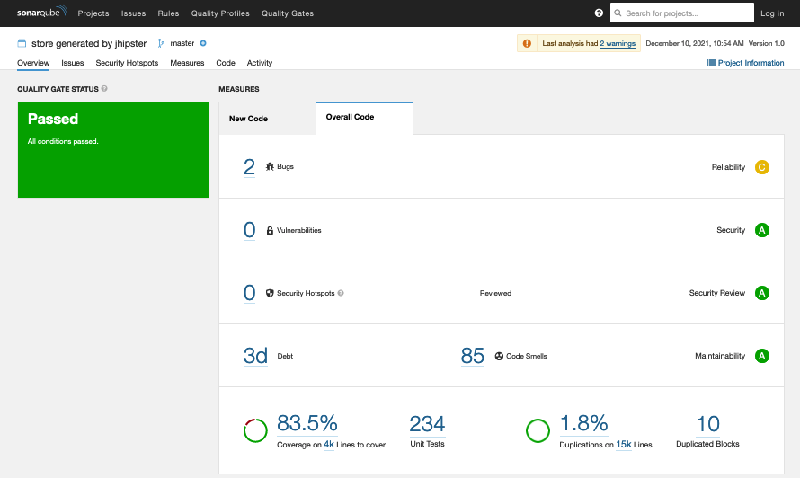

# Tutorial on Microservices Architecture with JHipster :: Generate a monolith application

## Get the files
```bash
mkdir -p ~/github/mastering-microservices/
git clone https://github.com/mastering-microservices/tutorial_en.git
```

## Generate the basic application
```bash
mkdir -p ~/github/mastering-microservices/online-store
cd  ~/github/mastering-microservices/online-store
nvm use stable
jhipster
```

```
? Which *type* of application would you like to create? Monolithic application 
(recommended for simple projects)
? What is the base name of your application? store
? Do you want to make it reactive with Spring WebFlux? No
? What is your default Java package name? mosig.cloud.store
? Which *type* of authentication would you like to use? JWT authentication 
(stateless, with a token)
? Which *type* of database would you like to use? SQL (H2, PostgreSQL, MySQL, 
MariaDB, Oracle, MSSQL)
? Which *production* database would you like to use? PostgreSQL
? Which *development* database would you like to use? H2 with disk-based 
persistence
? Which cache do you want to use? (Spring cache abstraction) Ehcache (local 
cache, for a single node)
? Do you want to use Hibernate 2nd level cache? Yes
? Would you like to use Maven or Gradle for building the backend? Gradle
? Do you want to use the JHipster Registry to configure, monitor and scale your 
application? No
? Which other technologies would you like to use? 
? Which *Framework* would you like to use for the client? Angular
? Do you want to generate the admin UI? Yes
? Would you like to use a Bootswatch theme (https://bootswatch.com/)? Default 
JHipster
? Would you like to enable internationalization support? Yes
? Please choose the native language of the application French
? Please choose additional languages to install English
? Besides JUnit and Jest, which testing frameworks would you like to use? 
Cypress, Gatling, Cucumber
? Would you like to install other generators from the JHipster Marketplace? No
? Would you like to generate code coverage for Cypress tests? [Experimental] Yes
? Would you like to audit Cypress tests? Yes
```

> Remark: You can add more languages for the internationalization support.

> Remark: You can choose React or Vue for the client framework if you feel more confortable with them.

> Remark: Have a glance on available sub-generators : https://www.jhipster.tech/modules/marketplace/#/list (some are not compliant with the current version of JHipster and some are not available for the frontend framework)

> The datatsore should be `PostgreSQL` since PostgreSQL is a free addon on Heroku and the Heroku MySQL addon is not free.

Read the commit message

```bash
git log
```

Check the generation parameters

```bash
cat .yo-rc.json
```

Count the lines of code

```bash
cloc src/ webpack/
cloc src/ webpack/ *.json *.xml
```

Estimate the cost and the time for coding the basic application using a [Cocomo calculator](http://softwarecost.org/tools/COCOMO/) and some job salary propositions for fulstack developers.

Read the readme

```bash
cat README.md
```

Run the application in `dev` profile.

```bash
./gradlew
```

> If gradlew fails on `java.lang.IllegalArgumentException: Unsupported class file major version 6x`, you must edit this `gradle/wrapper/gradle-wrapper.properties` for fixing a newer version of the gradle binary (`gradle-*-bin.zip`)

Sign in as `admin` `admin` and browse the menu (including the API Swagger thru Swagger UI).

```bash
open http://localhost:8080
```

## Generate the entities and the relationships

Read first https://www.jhipster.tech/jdl/intro

Show the [schema of the monolith application](./online-store.jh) with [JDL Studio](https://start.jhipster.tech/jdl-studio/). The scrrenshot is[here](./online-store.jh.png).

Generare the source files (for the frontend and the backend) according the entities et the relationships.
```bash
cd  ~/github/mastering-microservices/online-store
jhipster import-jdl ../tutorial_en/monolith/online-store.jh
```

Check the generation parameters

```bash
cat .yo-rc.json
ls -al .jhipster
```

Count the lines of code

```bash
cloc src/ webpack/
cloc src/ webpack/ *.json *.xml
```

Estimate the new cost and the new time for coding the basic application using a [Cocomo calculator](http://softwarecost.org/tools/COCOMO/) and some job salary propositions for fulstack developers.


Run the application in `dev` profile.
```bash
./gradlew
```

Open the web application served by the backend and sign in as `admin` `admin` and browse the menu (including the API Swagger thru Swagger UI).

```bash
open http://localhost:8080
```

Run the application in `dev` profile with the browser synchronization
```bash
yarn start
# npm start
```

Open the web application served by the BrowserSync (launched by `yarn start`) and sign in as `admin` `admin` and browse the menu (including the API Swagger thru Swagger UI).

```bash
open http://localhost:????
```

Complete the field `footer` with your name into the `i8n` messages files:
* src/main/webapp/i18n/fr/global.json
* src/main/webapp/i18n/en/global.json
* src/main/webapp/i18n/<YOUR FAVORITE LANGUAGE>/global.json

## One-step generation

> This section is optional.

You can directly generate the application with the entities 
```bash
mkdir -p ~/github/mastering-microservices/online-store-1step
cd  ~/github/mastering-microservices/online-store-1step
wget https://raw.githubusercontent.com/jhipster/jdl-samples/main/e-commerce-monolith.jdl
```

Edit `e-commerce-monolith.jdl` in order to
* change the database system (`postgresql` instead of `mysql`)
* change the client framework (`angular` instead of `react`)
* and add properties to the `Product` entity with your custom regex `pattern`s.

```bash
jhipster import-jdl e-commerce-monolith.jdl
```

## Testing

> This section is optional.

Read first https://www.jhipster.tech/running-tests/

### For the backend

```bash
cd  ~/github/mastering-microservices/online-store
./gradlew test
```

### For the frontend
```bash
yarn test
```

## End-to-End (e2e) testing

Term 1
```bash
cd  ~/github/mastering-microservices/online-store
./gradlew
```

Term 2
```bash
cd  ~/github/mastering-microservices/online-store
yarn e2e
```

> If the e2e test is too long, you can interupt it !

## Code quality analysis with SonarQube

> This section is optional.

Read first https://www.jhipster.tech/code-quality/

Launch the SonarQube container

```bash
cd  ~/github/mastering-microservices/online-store
docker-compose -f src/main/docker/sonar.yml up -d
docker-compose -f src/main/docker/sonar.yml logs -f
^C
```

> Remark: you should probably edit src/main/docker/sonar.yml for changing the version (3.9 --> 3.3) according to your Docker Compose version.

When the container is up, launch the SonarQube analyser

Remove the file `src/test/*/user.feature` (or fix it !) since the test is failed !
```bash
find src -name "*.feature"
```

```bash
./gradlew -Pprod clean check jacocoTestReport sonarqube -Dsonar.host.url=http://localhost:9001
```

Show the SonarQube report

```bash
open http://localhost:9001
open http://localhost:9001/dashboard?id=store
```



## CI/CD with Github actions

> This section is optional.

Read first https://www.jhipster.tech/setting-up-ci/

Generate the CI/CD files for Github actions

```bash
cd  ~/github/mastering-microservices/online-store
jhipster ci-cd
```

Anwser to the questions:
```
🚀 Welcome to the JHipster CI/CD Sub-Generator 🚀
? What CI/CD pipeline do you want to generate? GitHub Actions
? What tasks/integrations do you want to include ? Analyze your code with *Sonar*, Build and publish a *Docker* 
image, *Snyk*: dependency scanning for security vulnerabilities (requires SNYK_TOKEN), Deploy to *Heroku* (requires
 HEROKU_API_KEY set on CI service), Would you like to enable the *Cypress Dashboard* (requires both 
CYPRESS_PROJECT_ID and CYPRESS_RECORD_KEY set on CI service)
? *Sonar*: what is the URL of the Sonar server ? https://sonarcloud.io
? *Sonar*: what is the Organization of the Sonar server ? mosig
? *Docker*: what is the name of the image ? jhipster/store
? *Heroku*: name of your Heroku Application ? store
```


## CI/CD with a local Jenkins server

> This section is optional.

Anwser to the questions:
```
🚀 Welcome to the JHipster CI/CD Sub-Generator 🚀
? What CI/CD pipeline do you want to generate? Jenkins pipeline
? Would you like to perform the build in a Docker container ? No
? Would you like to send build status to GitLab ? No
? What tasks/integrations do you want to include ? Deploy your application to an *Artifactory*, Analyze your code 
with *Sonar*, Build and publish a *Docker* image, *Snyk*: dependency scanning for security vulnerabilities 
(requires SNYK_TOKEN), Deploy to *Heroku* (requires HEROKU_API_KEY set on CI service)
? *Artifactory*: what is the ID of distributionManagement for snapshots ? snapshots
? *Artifactory*: what is the URL of distributionManagement for snapshots ? 
http://artifactory:8081/artifactory/libs-snapshot
? *Artifactory*: what is the ID of distributionManagement for releases ? releases
? *Artifactory*: what is the URL of distributionManagement for releases ? 
http://artifactory:8081/artifactory/libs-release
? *Sonar*: what is the name of the Sonar server ? sonar
? *Heroku*: name of your Heroku Application ? store
WARNING! No support for Artifactory yet, when using Gradle.
```


Install and launch the Jenkins server
```bash
mkdir -p ~/github/mastering-microservices/jenkins
wget http://ftp-chi.osuosl.org/pub/jenkins/war-stable/2.150.1/jenkins.war
java -jar jenkins.war --httpPort=8989
```

Open the configuration panel of the Jenkins console
```bash
open https://localhost:8989
```

Configure the Jenkins server. The admin key can be found in the console trace of the Jenkins application. You can add addons like [Blue Ocean](https://jenkins.io/projects/blueocean/), ...

Generate the pipeline Jenkinsfile for your project online-store
```bash
cd  ~/github/mastering-microservices/online-store
jhipster ci-cd
cat Jenkinsfile
```

Push the `online-store` project to your Git repository (public or private) previously create.
```bash
GITHUB_USERNAME=moncomptegithub
git remote add origin git@github.com:$GITHUB_USERNAME/online-store.git
git push -u origin master
```

Add the pipeline `Jenkinsfile` for the project `online-store`.


